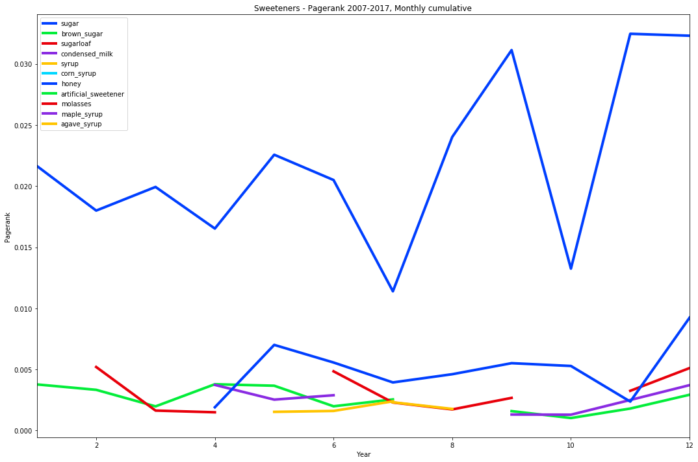

## Sweetness and Networks

This project presents a longitudinal analysis of the centrality of sweeteners in Colombia from 1977 to 2017. This code accompanies my book chapter "Network Science: Sugar in Colombia" in the book Practicing Food Studies which can be purchased online [here] ([https://daringfireball.net/projects/markdown/](https://nyupress.org/9781479828081/practicing-food-studies/) or [here] (https://www.amazon.com/Practicing-Food-Studies-Amy-Bentley/dp/1479828092)

The main #findings show that sugar is by far the most central ingredient as measure by PageRank. however, over the past decase alternative sweeteners such as honey and sugarloaf have been picking up. This evidences changes in food consumption trends. This can inform product development. Moreover, even though Colombia does not have traditional seasons such as winter and summer, there are seasonality patters such as two peaks for Halloween and Christmas. The main method used is network science

This analysis is based on a dataset of nearly 6000 recipes published in a magazine from 1977-2017. This dataset was self-collected from archival sources. The dataset may be available with a confideality agreement for the sake of reproducibility as I am currently working on other projects using this dataset. All versions of the data are available: From archival images, to standardized formats, to networks.

Changes over the years:

Changes throughout one year (seasonality):

