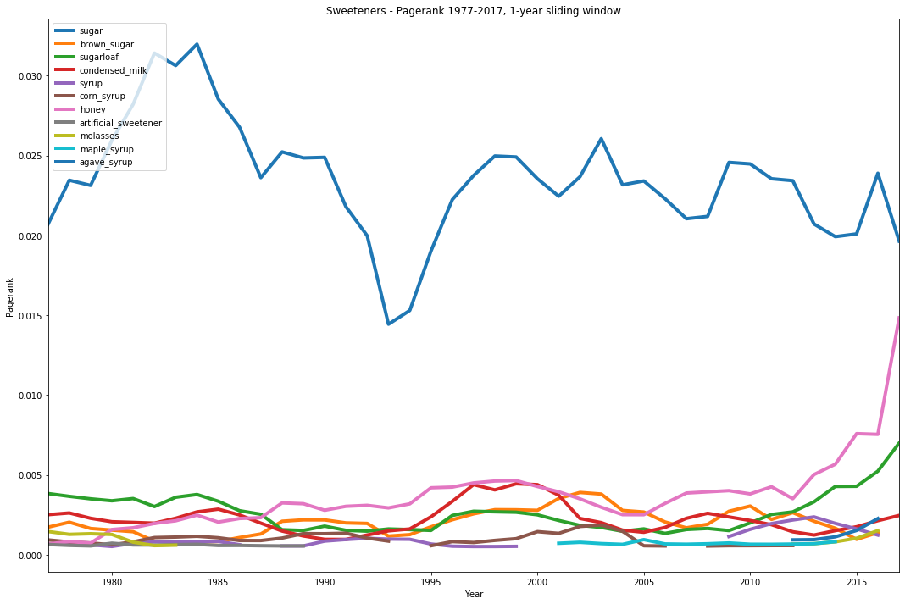

## Sweetness and Networks

This project presents a longitudinal analysis of the centrality of sweeteners in a developing country from 1977 to 2017. 

The main findings show that sugar is by far the most central ingredient as measure by PageRank. however, over the past decase alternative sweeteners such as honey and sugarloaf have been picking up. This evidences changes in food consumption trends. This can inform product development.

This analysis is based on a dataset of nearly 6000 recipes published in a magazine from 1977-2017. This dataset was self-collected from archival sources. The dataset may be available with a confideality agreement for the sake of reproducibility. All versions of the data are available: from images, to standardized formats, to networks. 

